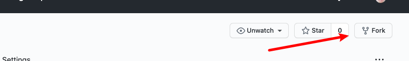
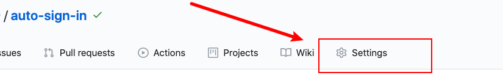
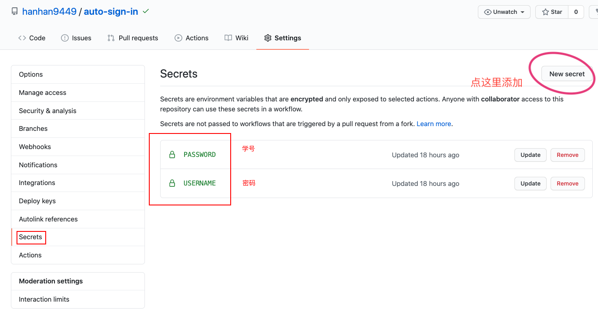

# auto-sign-in
成都大学isp系统自动签到系统（疫情期间）

## 使用之前
如果你没有github账号，则需要在你使用之前注册（Sign up）一个github账号

## 使用方法
1. fork本仓库

    
2. 在自己的secrets中加入`USERNAME`, `PASSWORD`，其中`USERNAME`是你的学号，`PASSWORD`是你的isp系统密码
    
    
    
3. 默认设置为早上七点签到，所以晚上设置了就等明天才能看见效果

test
